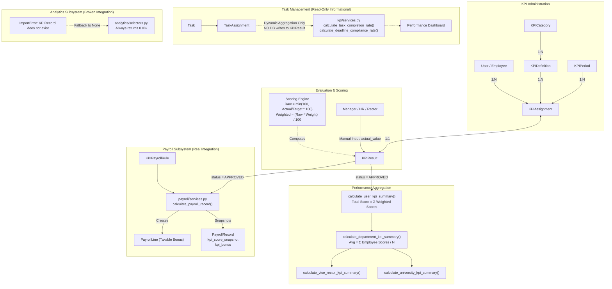

# KPI SYSTEM — FORENSIC LOGIC AUDIT & CURRENT-STATE REPORT

> **READ-ONLY AUDIT REPORT**  
> **Target Application**: University Task Management Platform  
> **Audited Modules**: `kpi/`, `payroll/`, `analytics/`, `tasks/`, `workflow/`, `organization/`, `hr/`  
> **Audited Commit / Version**: Phase 9+ / Hardened Workflow Baseline  
> **Audit Status**: Complete, Verified Against Live Python/Django Runtime  

---

## 1. Executive Summary

A deep forensic code audit of the Key Performance Indicator (KPI) subsystem was conducted across the codebase. The objective was to determine how a KPI is currently defined, assigned, measured, scored, calculated, displayed, audited, and connected to task execution and payroll compensation.

### Core Audit Findings:
1. **Model Architecture**: The `kpi` app implements a clean 5-model relational hierarchy:
   $$\text{KPICategory} \longrightarrow \text{KPIDefinition} \longrightarrow \text{KPIAssignment} \longleftrightarrow \text{KPIResult}$$
   governed by evaluation windows defined in **`KPIPeriod`**.
2. **Semi-Automated vs. Manual Reality**:
   - **Task Metrics are Informational Only**: While `kpi/services.py` contains automated calculation helpers (`calculate_task_completion_rate` and `calculate_deadline_compliance_rate`), **these functions DO NOT automatically write or update `KPIResult` records**.
   - **Manual Evaluation Bottleneck**: For an employee's KPI indicator to receive an actual value, raw score, or weighted score, an authorized evaluator (or test) must manually submit the actual number via `KPIEvaluationView` (`/kpi/assignments/<uuid:pk>/evaluate/`) or invoke `record_kpi_result()`.
3. **Flawed Deadline Compliance Logic**:
   In `calculate_deadline_compliance_rate()`, on-time status is calculated by comparing `assign.task.updated_at.date()` against `assign.task.deadline`, **instead of using `assign.task.completed_at`**. Any subsequent edit or comment on a completed task alters `task.updated_at`, which can retroactively convert an on-time task into a late task!
4. **Payroll Integration is Real and Enforced**:
   `payroll/services.py` actively integrates with approved KPI results. During payroll calculation, the engine filters for `KPIResult(status=APPROVED)`, sums the weighted scores for the period, matches them against `KPIPayrollRule` threshold tiers, and awards either a percentage of base salary or a fixed monetary bonus as a taxable `PayrollLine`.
5. **Analytics Subsystem Disconnection (Critical Import Bug)**:
   In `analytics/selectors.py` (lines 22–25) and `analytics/charts.py` (lines 16–18), the analytics subsystem attempts `from kpi.models import KPIRecord, KPIResult`. Because no model named `KPIRecord` exists in `kpi/models.py`, an `ImportError` is caught, `KPIRecord` is set to `None`, and all executive analytics charts/tables permanently report `0.0%` for KPI averages across all departments.

---

## 2. Current KPI Architecture & Mermaid Diagram



---

## 3. Data Model Audit

All models are defined in [`kpi/models.py`](file:///c:/Users/admin/Desktop/platforms/task_management/kpi/models.py) and inherit from `TimeStampedModel` (`created_at`, `updated_at`).

| Model | Purpose | Primary Key | Main Fields | Foreign Keys / Relationships | Constraints & Indexes |
|---|---|---|---|---|---|
| **`KPICategory`** | Classification group for indicators | UUID (`id`) | `name`, `code`, `description`, `order`, `is_active` | None | Unique: `code`. Indexes: `code`, `is_active`. Ordering: `['order', 'name']` |
| **`KPIPeriod`** | Assessment cycle window | UUID (`id`) | `name`, `code`, `period_type`, `start_date`, `end_date`, `status`, `is_active` | `created_by` (FK User, `SET_NULL`), `approved_by` (FK User, `SET_NULL`) | Unique: `code`. Indexes: `code`, `status`, `is_active`. Ordering: `['-start_date']` |
| **`KPIDefinition`** | Master indicator template | UUID (`id`) | `name`, `code`, `description`, `measurement_type`, `target_value`, `weight`, `min_value`, `max_value`, `is_active` | `category` (FK KPICategory, `PROTECT`), `applicable_department` (FK Dept, `SET_NULL`), `applicable_position` (FK Pos, `SET_NULL`), `applicable_grade` (FK Grade, `SET_NULL`) | Unique: `code`. Indexes: `code`, `is_active`. Ordering: `['category', 'name']` |
| **`KPIAssignment`** | Binds an indicator to an employee for a period | UUID (`id`) | `target_value`, `weight`, `is_active` | `kpi` (FK KPIDefinition, `PROTECT`), `user` (FK User, `CASCADE`), `period` (FK KPIPeriod, `CASCADE`), `assigned_by` (FK User, `SET_NULL`) | Unique: `['kpi', 'user', 'period']` (`unique_user_kpi_per_period`). Indexes: `['user', 'period']`, `['period', 'is_active']` |
| **`KPIResult`** | Evaluation scores and review state | UUID (`id`) | `actual_value`, `raw_score`, `weighted_score`, `status`, `notes`, `evaluated_at` | `assignment` (OneToOne KPIAssignment, `CASCADE`, `related_name='result'`), `evaluated_by` (FK User, `SET_NULL`) | OneToOne constraint on `assignment`. Index: `['status']`. Ordering: `['-updated_at']` |

### Related Models in Other Apps:
- **`payroll.KPIPayrollRule`** ([`payroll/models.py:L372`](file:///c:/Users/admin/Desktop/platforms/task_management/payroll/models.py)):
  - Fields: `name`, `min_score`, `max_score`, `bonus_type` (`PERCENTAGE` / `FIXED`), `bonus_value`, `effective_from`, `effective_to`, `is_active`.
  - Ordering: `['min_score']`. Validates `min_score <= max_score`.
- **`payroll.PayrollRecord`** ([`payroll/models.py:L460`](file:///c:/Users/admin/Desktop/platforms/task_management/payroll/models.py)):
  - Fields: `kpi_score_snapshot` (DecimalField, approved score at calculation), `kpi_bonus` (DecimalField, monetary bonus amount).

---

## 4. KPI Category Logic

1. **Creation & Management**:
   - Managed via standard Django admin or service layer.
   - Requires `can_manage_kpi` permission (Superadmin, Rector, or HR with `can_manage_kpi`).
2. **Hierarchy**: Categories are **flat** (no parent/child self-referential foreign keys).
3. **Activation**: Supported via boolean `is_active`. Inactive categories are excluded from list views.
4. **Scoping**: Categories are **global** across the university. They are not tied to specific departments, positions, or grades.
5. **Editing Safety**: Deleting a category that has definitions is blocked by `on_delete=models.PROTECT`. Editing category name/order does not affect existing assignments.

---

## 5. KPI Period Logic

1. **Cycle Types**:
   - Defined in `KPIPeriod.PeriodType`: `MONTHLY`, `QUARTERLY`, `YEARLY`. Default is `QUARTERLY`.
2. **Statuses**:
   - Defined in `KPIPeriod.Status`: `DRAFT`, `OPEN`, `CLOSED`.
3. **Creation Authority**:
   - Rector, Superadmin, or HR with `can_manage_kpi`.
   - Creation view: `KPIPeriodCreateView` ([`kpi/views.py:L125`](file:///c:/Users/admin/Desktop/platforms/task_management/kpi/views.py)). Automatically records `created_by = request.user`.
4. **Closure & Finalization**:
   - Implemented in `close_kpi_period()` ([`kpi/services.py:L322`](file:///c:/Users/admin/Desktop/platforms/task_management/kpi/services.py)).
   - **Strict Authority**: Only the Rector or Technical Superadmin can close a period (`if not (actor.is_superuser or actor.is_rector): raise PermissionDenied`).
   - Sets `status = CLOSED`, `approved_by = actor`.
   - Emits `AuditLog(action=KPI_PERIOD_CLOSED)`.
5. **Overlapping Period Protection**:
   - **NOT IMPLEMENTED IN CODE**: There is no database constraint or model validation preventing overlapping date ranges for periods. Multiple `OPEN` periods can exist concurrently.
6. **Mutations After Period Closure**:
   - **CRITICAL GAP**: Neither `KPIAssignment` nor `KPIResult` checks `assignment.period.status == CLOSED` before allowing edits in `record_kpi_result()`! Evaluators can still update scores on assignments belonging to a closed period unless blocked by view-level permissions.
7. **Working Year Connection**:
   - Periods have `start_date` and `end_date`. They are independent of `request.session['active_year']`. The active year session context does not automatically filter KPI periods.

---

## 6. KPI Definition Logic & Scoring Formulas

Defined in `KPIDefinition` ([`kpi/models.py:L88`](file:///c:/Users/admin/Desktop/platforms/task_management/kpi/models.py)).

### 6.1 Fields & Metadata
- `target_value`: Decimal (default `100.00`)
- `weight`: Decimal percentage (default `10.00`)
- `min_value` / `max_value`: Decimal bounds (default `0.00` / `100.00`)
- Applicability filters: `applicable_department`, `applicable_position`, `applicable_grade` (optional foreign keys for targeting indicators to specific organizational units).

### 6.2 The Actual Scoring Engine
Implemented in `record_kpi_result()` ([`kpi/services.py:L262-L283`](file:///c:/Users/admin/Desktop/platforms/task_management/kpi/services.py)).

Let $A = \text{Actual Value}$, $T = \text{Target Value}$, $W = \text{Weight}$.

#### Case 1: Boolean Measurement (`MeasurementType.BOOLEAN`)
$$\text{Raw Score} = \begin{cases} 100.00 & \text{if } A > 0 \\ 0.00 & \text{if } A \le 0 \end{cases}$$

#### Case 2: Rating Measurement (`MeasurementType.RATING` — 1 to 5 scale)
$$\text{Raw Score} = \min\left(100.00, \max\left(0.00, \frac{A}{5.0} \times 100.00\right)\right)$$

#### Case 3: Percentage, Numeric, Count (`PERCENTAGE`, `NUMERIC`, `COUNT`)
If $T > 0$:
$$\text{Raw Score} = \min\left(100.00, \max\left(0.00, \frac{A}{T} \times 100.00\right)\right)$$
If $T \le 0$:
$$\text{Raw Score} = \begin{cases} 100.00 & \text{if } A \ge 0 \\ 0.00 & \text{if } A < 0 \end{cases}$$

#### Weighted Contribution:
$$\text{Weighted Score} = \frac{\text{Raw Score} \times W}{100.00}$$

> [!NOTE]
> Clamping is strictly enforced: `Raw Score` cannot exceed `100.00` nor drop below `0.00`. Overachieving the target (e.g. delivering 120% of target) is truncated to 100.00%.

---

## 7. KPI Assignment Logic

Implemented in `KPIAssignment` ([`kpi/models.py:L157`](file:///c:/Users/admin/Desktop/platforms/task_management/kpi/models.py)).

1. **Who Can Receive a KPI**:
   - Only individual **Employees (`User`)**.
   - There are no direct department-level or position-level assignment rows in `KPIAssignment`.
2. **Who Can Assign**:
   - Superadmin, Rector, or HR with `can_manage_kpi`.
   - Evaluated in `can_manage_kpi(user)` ([`kpi/permissions.py:L27`](file:///c:/Users/admin/Desktop/platforms/task_management/kpi/permissions.py)).
   - Department Heads and Vice Rectors **CANNOT** assign KPIs.
3. **Cardinality & Uniqueness**:
   - An employee can have multiple KPI assignments within the same period.
   - Model constraint `unique_user_kpi_per_period` enforces that the same `(kpi, user, period)` tuple cannot be assigned more than once.
4. **Target & Weight Override**:
   - When assigning a KPI to an employee, the user can override the template's default `target_value` and `weight` specifically for that employee.

---

## 8. KPI Measurement Types

| Measurement Type | Input Range | Target Scale | Scoring Formula | Max Score | Min Score | Automation Level |
|---|---|---|---|:---:|:---:|:---:|
| `PERCENTAGE` | Decimal $\ge 0$ | e.g. `95.00` (%) | $\min(100, \frac{A}{T} \times 100)$ | 100.00 | 0.00 | **Manual Input** |
| `NUMERIC` | Decimal $\ge 0$ | Arbitrary number | $\min(100, \frac{A}{T} \times 100)$ | 100.00 | 0.00 | **Manual Input** |
| `COUNT` | Integer / Decimal | Quantity count | $\min(100, \frac{A}{T} \times 100)$ | 100.00 | 0.00 | **Manual Input** |
| `BOOLEAN` | $0$ or $1$ | $1$ (Yes) | $100$ if $A > 0$ else $0$ | 100.00 | 0.00 | **Manual Input** |
| `RATING` | $1.0$ to $5.0$ | $5.0$ (Max rating) | $\min(100, \frac{A}{5.0} \times 100)$ | 100.00 | 0.00 | **Manual Input** |

---

## 9. Task Management $\longrightarrow$ KPI Integration

### Forensic Verification:
We searched the entire repository for task signals, post-save hooks, workflow handlers, and Celery jobs.

> [!IMPORTANT]
> **THERE IS NO AUTOMATIC TASK-TO-KPI CALCULATION PIPELINE IN THE CODEBASE.**

- Completing a task does **NOT** trigger `record_kpi_result()`.
- Final approval of a deliverable does **NOT** update any `KPIResult` table.
- Task rejection or rework does **NOT** alter any KPI scores.
- Task priority or weight does **NOT** propagate to KPI weights.

### What Actually Exists:
In [`kpi/services.py`](file:///c:/Users/admin/Desktop/platforms/task_management/kpi/services.py), two helper functions dynamically calculate task metrics directly from `tasks.TaskAssignment` rows:
1. `calculate_task_completion_rate(user, start_date, end_date)`
2. `calculate_deadline_compliance_rate(user, start_date, end_date)`

These are called **on-the-fly during HTTP requests** when rendering `calculate_user_kpi_summary()` on the performance dashboard. They are displayed on cards, but **never saved to the database as KPI results**.

---

## 10. Deadline Compliance KPI Logic

Audit of `calculate_deadline_compliance_rate()` ([`kpi/services.py:L37-L70`](file:///c:/Users/admin/Desktop/platforms/task_management/kpi/services.py)):

```python
def calculate_deadline_compliance_rate(user: User, start_date=None, end_date=None) -> float:
    assignments = TaskAssignment.objects.filter(
        user=user,
        assignment_status=TaskAssignment.AssignmentStatus.APPROVED,
        task__status=Task.Status.COMPLETED,
    )
    # ... date filtering on task__created_at__date ...
    total_completed = assignments.count()
    if total_completed == 0:
        return 100.0

    on_time = 0
    for assign in assignments.select_related('task'):
        if assign.task.deadline:
            finish_date = assign.task.updated_at.date()
            if finish_date <= assign.task.deadline:
                on_time += 1
        else:
            on_time += 1

    return round((on_time / total_completed) * 100.0, 1)
```

### Forensic Anomalies Identified:
1. **Flawed Date Field (`updated_at` instead of `completed_at`)**:
   - The code uses `finish_date = assign.task.updated_at.date()`.
   - It **does not** use `task.completed_at`. If an executive updates a task note, exports a report, or modifies an unrelated field months after completion, `task.updated_at` refreshes to today's date, falsely making the task appear late!
2. **Zero Tasks Assigned Yields 100.0%**:
   - If an employee has completed 0 tasks, the function returns `100.0%` compliance rather than `0.0%` or `N/A`.
3. **Deadline Extension Handling**:
   - Because `assign.task.deadline` reflects the latest extended deadline, official deadline extensions do grant extra time to the calculation.
4. **Multiple Assignees**:
   - Each assignee has their own `TaskAssignment`. If the task is completed on time, all assigned users receive credit.

---

## 11. Task Completion KPI Logic

Audit of `calculate_task_completion_rate()` ([`kpi/services.py:L16-L35`](file:///c:/Users/admin/Desktop/platforms/task_management/kpi/services.py)):

```python
def calculate_task_completion_rate(user: User, start_date=None, end_date=None) -> float:
    assignments = TaskAssignment.objects.filter(user=user)
    # ... date filtering on task__created_at__date ...
    total = assignments.count()
    if total == 0:
        return 100.0

    completed = assignments.filter(
        assignment_status=TaskAssignment.AssignmentStatus.APPROVED,
        task__status=Task.Status.COMPLETED,
    ).count()
    return round((completed / total) * 100.0, 1)
```

### Forensic Details:
1. **Status Criteria**: Requires dual condition:
   - `assignment.assignment_status == TaskAssignment.AssignmentStatus.APPROVED`
   - `task.status == Task.Status.COMPLETED`
2. **In-Progress / Submitted Excluded**: First approval (`SECOND_APPROVAL`) and pending submission (`SUBMITTED`) do not count.
3. **Zero Tasks Baseline**: Returns `100.0%` if `total == 0`.
4. **Cancelled Tasks Penalty**: Cancelled tasks remain in `TaskAssignment` count (`total`), but their `task.status` is `CANCELLED`. Thus, cancelled tasks actively penalize an employee's completion rate!

---

## 12. Score Calculation Engine

Score calculation is performed in `record_kpi_result()` ([`kpi/services.py:L252`](file:///c:/Users/admin/Desktop/platforms/task_management/kpi/services.py)):

- **File**: `kpi/services.py`
- **Function**: `record_kpi_result(actor, assignment, actual_value, notes, request)`
- **Precision**: Uses Python `Decimal` for all arithmetic. Results rounded to 2 decimal places:
  ```python
  result.raw_score = round(raw_score, 2)
  result.weighted_score = round(weighted_score, 2)
  ```
- **Clamping**: Raw score is constrained to $[0.00, 100.00]$.

---

## 13. Overall Performance Score & Aggregation

### 13.1 Employee Total Score Formula
Implemented in `calculate_user_kpi_summary()` ([`kpi/services.py:L72`](file:///c:/Users/admin/Desktop/platforms/task_management/kpi/services.py)):

$$\text{Total Score} = \sum_{i=1}^n \text{Weighted Score}_i$$

where $\text{Weighted Score}_i = \frac{\text{Raw Score}_i \times \text{Weight}_i}{100}$.

### Forensic Defect in Aggregation:
The total score is **NOT normalized by total assigned weight**:
- If an employee has only 1 KPI assigned with Weight = 30%, and scores 100% on it:
  - $\text{Raw Score} = 100.00$
  - $\text{Weighted Score} = 30.00$
  - $\text{Total Score} = 30.0\%$!
- The dashboard template displays: `<h2 class="fw-bold ...">{{ user_summary.total_score }}%</h2>`.
- The system assumes the administrator always configures indicators whose weights sum to exactly 100.00%. If weights sum to less or more, the overall percentage display is distorted.

### 13.2 Department Average Formula
Implemented in `calculate_department_kpi_summary()` ([`kpi/services.py:L142`](file:///c:/Users/admin/Desktop/platforms/task_management/kpi/services.py)):

$$\text{Avg Dept Score} = \frac{\sum_{e \in E_{\text{assigned}}} \text{Total Score}_e}{|E_{\text{assigned}}|}$$

Employees with zero assigned KPIs are excluded from the denominator.

### 13.3 Vice Rector & University Average Formula
Implemented in `calculate_vice_rector_kpi_summary()` and `calculate_university_kpi_summary()` ([`kpi/services.py:L189, L214`](file:///c:/Users/admin/Desktop/platforms/task_management/kpi/services.py)):
- Averages the department average scores across supervised/active departments.
- **Anomaly**: The code explicitly checks `if summary['avg_kpi_score'] > 0: all_scores.append(...)`. Departments whose average score is `0.0` are completely dropped from the university/sector average!

---

## 14. Department KPI Logic

- **Does a separate Department KPI model exist?**
  **NO.** Department performance is purely an aggregate calculated dynamically from the department's active employees.
- **Can a Department Head view it?**
  Yes. In `PerformanceDashboardView` ([`kpi/views.py:L65`](file:///c:/Users/admin/Desktop/platforms/task_management/kpi/views.py)), a Department Head is automatically shown `view_type = 'DEPARTMENT'`.
- **Can a Vice Rector view it?**
  Yes. A Vice Rector sees all supervised departments via `calculate_vice_rector_kpi_summary()`.
- **Does Department KPI affect individual payroll?**
  No. Payroll bonuses are strictly bound to individual employee `KPIResult` records.

---

## 15. Role-Based Access Control Matrix (RBAC)

Audited from [`kpi/permissions.py`](file:///c:/Users/admin/Desktop/platforms/task_management/kpi/permissions.py) and [`kpi/views.py`](file:///c:/Users/admin/Desktop/platforms/task_management/kpi/views.py).

| Action / Capability | Technical Superadmin | Rector | Acting Rector | Vice Rector | Department Head | Employee | HR Manager | Finance |
|---|:---:|:---:|:---:|:---:|:---:|:---:|:---:|:---:|
| **View Own Dashboard** | YES | YES | YES | YES | YES | YES | YES | YES |
| **View Subordinate KPI** | YES | YES | YES | SCOPED (Sector) | SCOPED (Dept) | NO | SCOPED (HR Perm) | NO |
| **View KPI Catalog** | YES | YES | YES | YES | YES | NO | YES | NO |
| **Create/Edit Definitions** | YES | YES | YES | NO | NO | NO | SCOPED (HR Perm) | NO |
| **Create KPI Periods** | YES | YES | YES | NO | NO | NO | SCOPED (HR Perm) | NO |
| **Close KPI Periods** | YES | YES | YES | NO | NO | NO | NO | NO |
| **Assign KPI to Staff** | YES | YES | YES | NO | NO | NO | SCOPED (HR Perm) | NO |
| **Enter/Record Actual Score** | YES | YES | YES | SCOPED | SCOPED | NO | SCOPED | NO |
| **Approve/Finalize Score** | YES | YES | YES | NO | NO | NO | SCOPED (HR Perm) | NO |
| **View University Score** | YES | YES | YES | NO | NO | NO | YES | NO |

---

## 16. KPI Result Lifecycle

State machine defined in `KPIResult.Status` ([`kpi/models.py:L209`](file:///c:/Users/admin/Desktop/platforms/task_management/kpi/models.py)):

```
[KPIAssignment Created]
         │
         ▼
       DRAFT (Initial state upon creation)
         │
         ▼ (Evaluator calls record_kpi_result)
  ┌──────────────┴──────────────┐
  │ Actor is Manager            │ Actor is Rector / Superadmin / HR
  ▼                             ▼
SUBMITTED                    REVIEWED
  │                             │
  └──────────────┬──────────────┘
                 │
                 ▼ (Actor with can_approve_kpi calls approve_kpi_result)
              APPROVED (Finalized & Eligible for Payroll Bonus)
```

### Transition Audit:
1. `record_kpi_result()`:
   - If actor is `superuser`, `rector`, or `hr`: moves to `REVIEWED`.
   - If actor is Department Head or Vice Rector: moves to `SUBMITTED`.
2. `approve_kpi_result()`:
   - Moves to `APPROVED`. Sets `evaluated_at = timezone.now()`.
3. **Immutability Check**:
   - **NOT CONFIRMED FROM CODE**: There is no code lock preventing an approved result from being overwritten by another call to `record_kpi_result()`. An approved result can be re-evaluated and overwritten unless guarded by custom business logic.

---

## 17. Manual vs. Automatic KPI Breakdown

| Measurement Category | Automatic Tracking? | Automatic Result Entry? | Evaluator Role |
|---|---|---|---|
| **Task Completion Rate** | Dynamic calculation on Dashboard | **NO** | Evaluator must manually read rate and submit value |
| **Deadline Compliance Rate** | Dynamic calculation on Dashboard | **NO** | Evaluator must manually read rate and submit value |
| **Quality Rating (1-5)** | None (Subjective) | **NO** | Manager reviews evidence and submits score |
| **Documentation Completeness** | None | **NO** | Manual percentage entry |
| **Boolean Milestones** | None | **NO** | Manual 1/0 entry |

**Conclusion**: The system is **100% manual on recording results**. Automated algorithms exist solely as diagnostic dashboard indicators.

---

## 18. KPI + Payroll Integration Audit

Audited from [`payroll/services.py:L306-L351`](file:///c:/Users/admin/Desktop/platforms/task_management/payroll/services.py).

### How It Works:
1. During monthly payroll calculation (`calculate_payroll_record()`), the system queries:
   ```python
   kpi_results = KPIResult.objects.filter(
       assignment__user=employee,
       status=KPIResult.Status.APPROVED,
   )
   ```
2. It filters by payroll period dates:
   ```python
   period_kpi_results = kpi_results.filter(
       models.Q(assignment__period__code=period.code) |
       models.Q(assignment__period__start_date__lte=period.end_date, assignment__period__end_date__gte=period.start_date)
   )
   ```
3. If period matching results exist, it sums their `weighted_score`:
   $$\text{KPI Score} = \sum r.\text{weighted\_score}$$
   *(Fallback: if no date match exists, it sums up to 5 approved results).*
4. Threshold Evaluation against `KPIPayrollRule`:
   ```python
   rule = KPIPayrollRule.objects.filter(
       is_active=True, min_score__lte=kpi_score, max_score__gte=kpi_score
   ).order_by('-max_score').first()
   ```
5. Bonus Computation:
   - If `bonus_type == PERCENTAGE`:
     $$\text{Bonus} = \frac{\text{Base Salary} \times \text{bonus\_value}}{100}$$
   - If `bonus_type == FIXED`:
     $$\text{Bonus} = \text{bonus\_value}$$
6. Line Item & Snapshot:
   - Appends a `PayrollLine` (Component: `BONUS`, `taxable=True`).
   - Persists immutable snapshots on `PayrollRecord`:
     - `record.kpi_score_snapshot = kpi_score`
     - `record.kpi_bonus = kpi_bonus`

---

## 19. Analytics Subsystem Integration Audit

Audited from [`analytics/selectors.py`](file:///c:/Users/admin/Desktop/platforms/task_management/analytics/selectors.py) and [`analytics/charts.py`](file:///c:/Users/admin/Desktop/platforms/task_management/analytics/charts.py).

### Critical Finding: The `KPIRecord` Import Defect
In `analytics/selectors.py`:
```python
try:
    from kpi.models import KPIRecord, KPIResult
except ImportError:
    KPIRecord = None
    KPIResult = None
```
- The developer who authored `analytics` assumed a model named `KPIRecord` existed with a field `final_score`.
- In reality, the model is named `KPIResult` and has fields `raw_score` and `weighted_score`.
- As a consequence of the caught `ImportError`:
  - `KPIRecord` is always `None`.
  - Every analytics query checking `if KPIRecord:` bypasses execution.
  - Institutional Analytics Executive Dashboard ([`templates/analytics/executive_dashboard.html`](file:///c:/Users/admin/Desktop/platforms/task_management/templates/analytics/executive_dashboard.html)) always renders:
    - **KPI Average: `0.0%`**
    - **Department KPI Comparison Table: `0.0%` for all departments**

---

## 20. Notifications & Audit Trail

### 20.1 Audit Log (`AuditLog`)
Audited from [`core/models.py`](file:///c:/Users/admin/Desktop/platforms/task_management/core/models.py) and [`kpi/services.py`](file:///c:/Users/admin/Desktop/platforms/task_management/kpi/services.py):
The following actions are actively logged to `AuditLog`:
- `KPI_RESULT_RECORDED` (includes `actual_value`, `raw_score`, `weighted_score`, `period`)
- `KPI_RESULT_APPROVED` (includes `weighted_score`)
- `KPI_PERIOD_CLOSED` (includes period code)

### 20.2 In-App Notifications (`Notification`)
- **NOT IMPLEMENTED FROM CODE**: No in-app notifications (`Notification.objects.create(...)`) are dispatched when a KPI is assigned, evaluated, or approved.

---

## 21. Security & IDOR Audit

1. **Object-Level Authorization on Evaluation**:
   - Protected by `ScopedKPIAssignmentAccessMixin` ([`kpi/permissions.py:L71`](file:///c:/Users/admin/Desktop/platforms/task_management/kpi/permissions.py)).
   - Enforces `can_view_kpi_for_user(request.user, assignment.user)`.
   - Verified by test `test_kpi_evaluation_authorization_and_idor`: An employee from the Library Department attempting to evaluate an IT employee's KPI received `403 Forbidden`.
2. **Queryset Scoping in Assignment List**:
   - Implemented in `KPIAssignmentListView.get_queryset()` ([`kpi/views.py:L151`](file:///c:/Users/admin/Desktop/platforms/task_management/kpi/views.py)):
     - Superadmin / Rector / HR: Sees all assignments.
     - Vice Rector: Scoped strictly to supervised departments (`user__department__in=scoped_depts`).
     - Department Head: Scoped strictly to own department (`user__department=user.department`).
     - Employee: Scoped strictly to own assignments (`user=request.user`).
3. **Period Close Vulnerability**:
   - In `KPIPeriodCloseView.post()` ([`kpi/views.py:L137`](file:///c:/Users/admin/Desktop/platforms/task_management/kpi/views.py)), permission is enforced inside `close_kpi_period()` service (`if not (actor.is_superuser or actor.is_rector): raise PermissionDenied`). Safe from IDOR.

---

## 22. Test Coverage Analysis

### Test Execution:
```bash
python manage.py test kpi.tests --keepdb
Found 5 test(s).
System check identified no issues (0 silenced).
.....
Ran 5 tests in 9.692s — OK
```

### Covered Areas:
1. `test_record_kpi_result_and_calculation`: Mathematical scoring for Percentage and Rating types.
2. `test_department_and_vice_rector_aggregates`: Multi-tier departmental aggregation.
3. `test_kpi_period_lifecycle_close`: Closing periods and audit log verification.
4. `test_role_scoped_kpi_views`: Dashboard rendering across 4 role tiers.
5. `test_kpi_evaluation_authorization_and_idor`: IDOR isolation between departments.

### Gaps Not Covered by Tests:
- Boolean and Count measurement type calculation edge cases.
- Attempting to evaluate an assignment belonging to a `CLOSED` period.
- Submitting negative actual values or values exceeding bounds.
- Overlapping period date creation.

---

## 23. Seed / Demo Data Audit

Audited from initial fixture backup [`backups/backup_20260904_122851_dev_test.json`](file:///c:/Users/admin/Desktop/platforms/task_management/backups/backup_20260904_122851_dev_test.json):

1. **Seeded Categories**:
   - `TASK_PERF`: Task & Workflow Execution (Order 1)
   - `QUALITY`: Quality & Compliance Standards (Order 2)
   - `DEADLINE`: Deadline Compliance & Reliability (Order 3)
   - `INNOVATION`: Digital Innovation & Research (Order 4)
2. **Seeded Periods**:
   - `2026-Q1`: Status `OPEN` (2026-07-06 to 2026-10-04)
   - `2025-Q4`: Status `CLOSED` (2026-04-07 to 2026-07-05)
3. **Seeded Definitions**:
   - `KPI_TASK_COMPLETION`: Target `95.00%`, Weight `35.00%`
   - `KPI_DEADLINE_ONTIME`: Target `90.00%`, Weight `25.00%`
   - `KPI_QUALITY_RATING`: Target `4.50` (Rating), Weight `25.00%`
   - `KPI_DOCS`: Target `100.00%`, Weight `15.00%`
4. **Seeded Payroll Rules**:
   - Tier 1: Score 90–100% $\to$ 15% Base Salary Bonus
   - Tier 2: Score 75–89.99% $\to$ 10% Base Salary Bonus
   - Tier 3: Score 60–74.99% $\to$ 5% Base Salary Bonus

---

## 24. Documentation Consistency Audit

| Topic | Documentation Says ([`docs/KPI_ARCHITECTURE.md`](file:///c:/Users/admin/Desktop/platforms/task_management/docs/KPI_ARCHITECTURE.md)) | Code Actually Does | Status |
|---|---|---|:---:|
| **Scoring Formula** | $\text{Raw} = \min(100, \frac{A}{T} \times 100)$ | Exact match in `record_kpi_result()` | **MATCH** |
| **Weighted Score** | $\text{Weighted} = (\text{Raw} \times W) / 100$ | Exact match in `record_kpi_result()` | **MATCH** |
| **Total Score** | $\text{Total} = \sum \text{Weighted Score}$ | Exact match in `calculate_user_kpi_summary()` | **MATCH** |
| **Task Automation** | "dynamically calculated by service layer directly from historical task records" | Calculated **only for dashboard display**; never recorded automatically to `KPIResult` | **PARTIAL** |
| **Period Lifecycle** | `DRAFT` $\to$ `OPEN` $\to$ `CLOSED` | Matches `KPIPeriod.Status` | **MATCH** |
| **Analytics Integration** | Implied full KPI tracking across institutional charts | `ImportError: KPIRecord` causes permanent `0.0%` fallback | **CONTRADICTED** |
| **Payroll Connection** | Documented in `docs/PAYROLL_ARCHITECTURE.md` | Fully matches implementation in `payroll/services.py` | **MATCH** |

---

## 25. Critical Findings

### Critical
1. **Analytics KPI Breakage**: `analytics/selectors.py` and `analytics/charts.py` fail on `from kpi.models import KPIRecord`, rendering all executive KPI analytics charts inoperative ($0.0\%$).
2. **Retroactive Deadline Compliance Distortion**: `calculate_deadline_compliance_rate()` checks `assign.task.updated_at.date()` instead of `task.completed_at`. Any post-completion edit flags on-time tasks as overdue.

### High
3. **No Closed-Period Mutation Lock**: Evaluators can modify or approve `KPIResult` records even after a `KPIPeriod` has been marked `CLOSED`.
4. **Unnormalized Total Score Display**: If assigned weights sum to $< 100\%$, the overall score percentage on employee and department dashboards is artificially deflated.

### Medium
5. **Zero-Score Department Exclusion**: `calculate_vice_rector_kpi_summary()` and `calculate_university_kpi_summary()` exclude departments with $0.0\%$ average, skewing institutional reporting upward.
6. **No Notification Pipeline**: Assigning or evaluating KPIs generates no entries in `Notification`.

### Low / Informational
7. **No Overlapping Period Constraint**: Multiple periods can span identical dates without database collision warnings.

---

## 26. Realistic End-to-End Example

### Scenario:
Employee **Aziz Sobirov** (IT Department) is evaluated for **2026-Q1** (`OPEN`).

1. **Indicators Assigned**:
   - **Indicator 1 (`KPI_TASK_COMPLETION`)**: Target = $90.00\%$, Weight = $60.00\%$
   - **Indicator 2 (`KPI_QUALITY_RATING`)**: Target = $5.00$ (Rating), Weight = $40.00\%$
   - *Total Assigned Weight = $100.00\%$*.
2. **Manual Evaluation**:
   - Department Head visits `/kpi/assignments/<id_1>/evaluate/`:
     - Enters `actual_value = 81.00`.
     - $\text{Raw Score} = \frac{81.00}{90.00} \times 100 = 90.00$.
     - $\text{Weighted Score} = \frac{90.00 \times 60.00}{100} = 54.00$.
   - Department Head visits `/kpi/assignments/<id_2>/evaluate/`:
     - Enters `actual_value = 4.50`.
     - $\text{Raw Score} = \frac{4.50}{5.00} \times 100 = 90.00$.
     - $\text{Weighted Score} = \frac{90.00 \times 40.00}{100} = 36.00$.
3. **Approval**:
   - Rector / HR approves both results $\to$ `status = APPROVED`.
4. **Summary Aggregation**:
   - Aziz's Total KPI Score = $54.00 + 36.00 = 90.00\%$.
5. **Payroll Processing**:
   - During monthly payroll calculation, Aziz's base salary is $10,000,000$ UZS.
   - The engine identifies approved KPI Score = $90.00$.
   - Matches `KPIPayrollRule(Tier 1: 90%–100% → 15% Bonus)`.
   - $\text{KPI Bonus} = \frac{10,000,000 \times 15}{100} = 1,500,000$ UZS.
   - Appends taxable `PayrollLine` and saves `kpi_score_snapshot = 90.00`, `kpi_bonus = 1500000.00`.

---

## 27. Final Maturity Rating & Verdict

### Current Maturity Scores
| Component | Score | Justification |
|---|:---:|---|
| **1. KPI Definition** | 9/10 | Well-structured model with targets, weights, and organizational filters |
| **2. Assignment** | 8/10 | Robust unique constraints; supports individual target/weight overrides |
| **3. Measurement Types** | 8/10 | Five distinct measurement types implemented with clamping |
| **4. Automatic Calculation** | 2/10 | Evaluation entry is 100% manual; no automated background recording |
| **5. Task Integration** | 3/10 | Calculations exist for display only; no persistence to KPI results |
| **6. Deadline Compliance** | 3/10 | Flawed comparison against `updated_at` rather than `completed_at` |
| **7. Performance Aggregation**| 7/10 | Clear hierarchical roll-up; minor distortion when weights $\ne 100$ |
| **8. Payroll Integration** | 9/10 | Robust threshold matching, snapshots, and bonus line creation |
| **9. Analytics Integration** | 1/10 | Broken by import error on non-existent `KPIRecord` |
| **10. Security / RBAC** | 9/10 | Strong scoped mixins, IDOR protection, and catalog isolation |
| **11. Audit / History** | 7/10 | AuditLog active on evaluations; missing Notification events |
| **12. Test Coverage** | 7/10 | 5 tests passing; covers calculation, IDOR, and aggregation |

### Summary Verdicts:
- **WHAT CURRENTLY WORKS**: Manual KPI definition, period creation/closure, assignment with target override, mathematical raw/weighted score calculation, role-scoped performance dashboard, and payroll bonus generation from approved results.
- **WHAT PARTIALLY WORKS**: Task completion and deadline compliance algorithms (work for dynamic dashboard display, but flawed by `updated_at` bug and not linked to result records).
- **WHAT DOES NOT WORK**: Institutional Analytics KPI overview (broken by `KPIRecord` import bug).
- **WHAT IS ONLY CONFIGURATION**: Automated task-based KPI result submission (must be manually recorded).
- **WHAT IS NOT IMPLEMENTED**: Automatic daily/periodic background jobs syncing completed tasks to KPI indicators, notifications for KPI evaluations, and period date overlap validation.
- **WHAT SHOULD NOT BE CHANGED WITHOUT BUSINESS APPROVAL**: Mathematical scoring formulas, bonus tier percentages, and role permission boundaries.
