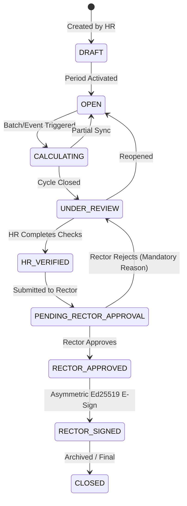

# University Performance & KPI System Architecture (KPI 2.0)
=============================================================================

## 1. Executive Summary & Purpose
The University Performance & KPI Management Platform (KPI 2.0) provides a production-grade, mathematically sound, tamper-evident, and auditable framework for evaluating academic, managerial, and administrative personnel across the university.

Unlike simplistic evaluation spreadsheets, KPI 2.0 couples operational task workflows, HR employment records, and executive electronic signature verification directly to quantitative performance bonuses and institutional analytics.

---

## 2. Core Architectural Philosophy
1. **Mathematical Fairness**: Configured indicator weights are dynamically normalized to 100% across assigned indicators. Zero indicators assigned or zero task data never generates arbitrary 0.0 scores if no data policy applies.
2. **Transparent Evidence**: Every score calculation records a deterministic JSON calculation payload containing raw counts, timestamps, formula expressions, and audit trails.
3. **Decoupled Roles & Separation of Duties**:
   - HR establishes periods, defines institutional indicators, and performs pre-review verification.
   - Deans / Department Heads review operational metrics and evaluate manual criteria within their departments.
   - Vice Rectors monitor supervised sectors and provide strategic evaluations.
   - Rector (or officially delegated Acting Rector) holds exclusive legal approval, electronic signing authority, and final revision control.
4. **Non-Repudiation & Cryptographic Snapshots**: Approved evaluation periods are frozen into an immutable canonical JSON snapshot signed using asymmetric Ed25519 cryptography, verified via verification IDs and public QR codes.
5. **Strict Payroll Separation**: The payroll engine will NEVER compute performance bonuses from draft, open, or unapproved evaluation cycles. Bonuses are strictly derived from Rector-signed or finalized periods.

---

## 3. Mathematical Models & Formulas

### 3.1. Dynamic Weight Normalization
Employees may have different numbers of indicators assigned depending on their department, academic rank, or contract type. To ensure a consistent 100-point total scale:

$$\text{Weight Sum } W = \sum_{i=1}^{n} w_i$$

$$\text{Effective Weight } w_{i,\text{norm}} = \left(\frac{w_i}{W}\right) \times 100$$

### 3.2. Indicator Scoring by Direction
Each KPI definition specifies a target $T$, an actual recorded value $A$, and a direction:

1. **MAXIMIZE** (Higher is better, e.g., published papers, completed tasks):
   $$\text{Raw Score} = \min\left(100, \max\left(0, \frac{A}{T} \times 100\right)\right)$$

2. **MINIMIZE** (Lower is better, e.g., overdue tasks, error rates):
   $$\text{Raw Score} = \max\left(0, \min\left(100, \left(1 + \frac{T - A}{T}\right) \times 100\right)\right)$$

3. **EXACT** (Exact match desired, e.g., quota completion):
   $$\text{Raw Score} = \max\left(0, 100 - \left|\frac{A - T}{T}\right| \times 100\right)$$

### 3.3. Final Composite Employee Score
$$\text{Final Score} = \sum_{i=1}^{n} \left(\text{Raw Score}_i \times \frac{w_{i,\text{norm}}}{100}\right)$$

### 3.4. University & Sector Rollups
- **Department Score**: The arithmetic mean of active employees in that department:
  $$\text{Score}_{\text{Dept}} = \frac{1}{|E_{\text{dept}}|} \sum_{e \in E_{\text{dept}}} \text{Final Score}_e$$
- **Vice-Rectorate Sector Score**: The headcount-weighted average of supervised departments.
- **University Average**: The mean performance across all evaluated university personnel.

---

## 4. Lifecycle State Machine

### State Transitions & Rules:
1. **DRAFT $\to$ OPEN**: Activated for assignment and metric accumulation.
2. **OPEN $\to$ UNDER_REVIEW**: Operational data input period ends; system evaluates all staff metrics.
3. **UNDER_REVIEW $\to$ HR_VERIFIED**: HR runs compliance checks, verifies evidence, and signs off.
4. **HR_VERIFIED $\to$ PENDING_RECTOR_APPROVAL**: Period package presented to university leadership.
5. **PENDING_RECTOR_APPROVAL $\to$ UNDER_REVIEW**: If Rector rejects, mandatory feedback is recorded, notifications are dispatched to HR and Department Heads, and status returns to `UNDER_REVIEW`.
6. **PENDING_RECTOR_APPROVAL $\to$ RECTOR_APPROVED**: Executive approval recorded.
7. **RECTOR_APPROVED $\to$ RECTOR_SIGNED**: Canonical JSON snapshot generated, Ed25519 signature generated, verification ID assigned, and all results locked (`Status.LOCKED`).
8. **RECTOR_SIGNED $\to$ CLOSED**: Period archived; payroll engine unlocks bonus compensation lines.

---

## 5. Automated Data Sources vs Manual Evaluators
1. **Automated Indicator Engines**:
   - `TASK_COMPLETION_RATE`: Calculated from assigned, in-progress, and final-approved task workflow records.
   - `TASK_ON_TIME_RATE`: Percentage of completed tasks submitted and approved on or before the deadline.
   - `TASK_VOLUME`: Total completed operational assignments in the cycle.
2. **Manual Indicators**:
   - Academic research outputs, conference presentations, student evaluations, behavioral compliance.
   - Evaluated by Department Heads or authorized HR officers with mandatory notes and justification.

---

## 6. Electronic Signature & Anti-Fraud Security
- **Algorithm**: Asymmetric Ed25519 digital signature generated using the university Rector private key.
- **Payload Hash**: SHA-256 hash computed over the canonical, deterministic JSON serialization of the period, summary scores, and department rollups.
- **Verification**: Publicly verifiable without authentication via `/signatures/verify/<verification_id>/` with QR code support.
- **Snapshot Immutability**: Any alteration to a signed period or its underlying locked `KPIResult` records is immediately detected as a hash mismatch by verification algorithms.

---

## 7. Payroll Integration Architecture
1. **Strict Gatekeeping**: Payroll run queries `KPIPeriod.Status.RECTOR_SIGNED` or `KPIPeriod.Status.CLOSED`. Unsigned or under-review periods are completely ignored.
2. **Snapshot Traceability**: Each payroll bonus line references the specific KPI period ID, score snapshot, and applicable `KPIPayrollRule`.
3. **No Retroactive Recalculation**: Once a payroll run is computed from a signed KPI snapshot, historical modifications to task history or manual results cannot alter the historical payroll record.

---

## 8. Role Responsibilities Matrix

| Role | Catalog Management | Evaluation / Manual Input | Period Verification | Executive Approval | Electronic Signing | Payroll Bonus Generation |
| :--- | :---: | :---: | :---: | :---: | :---: | :---: |
| **Rector / Acting Rector** | View / Manage | Final Authority | Oversees | **Exclusive** | **Exclusive** | Approves |
| **Vice Rector** | View | Supervised Sectors | Reviews | &times; | &times; | &times; |
| **Department Head** | View | Department Staff | First Review | &times; | &times; | &times; |
| **HR Manager** | Manage | University Input | **Mandatory** | &times; | &times; | Consumes |
| **Employee** | Personal View | View Own / Contest | &times; | &times; | &times; | Beneficiary |
